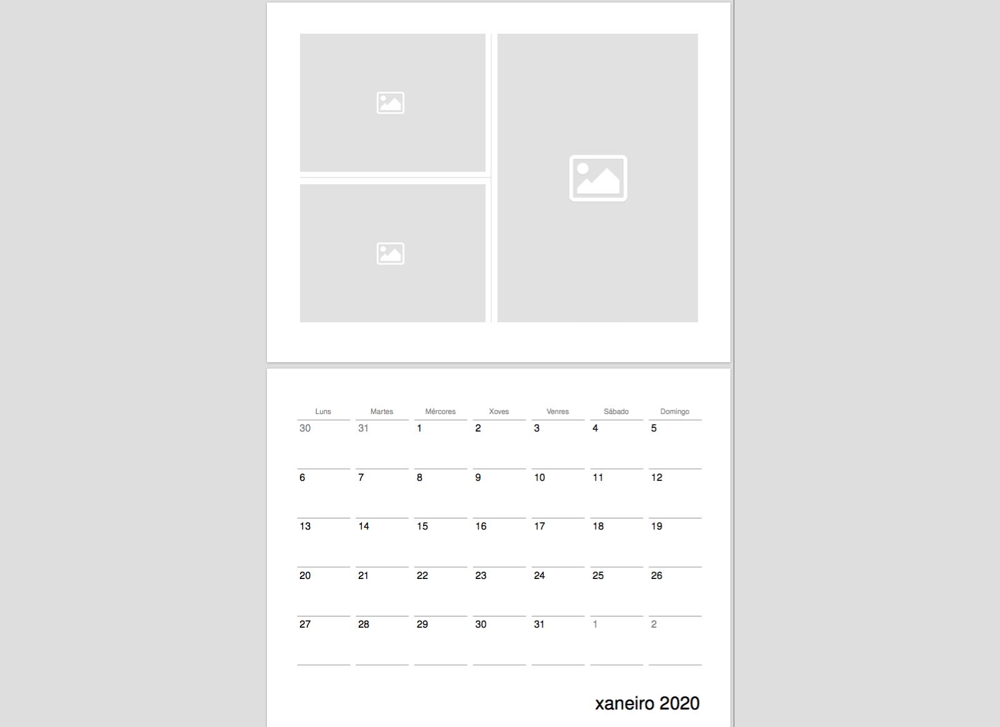

# iPhoto-calendar-remake

For those who miss the good old photo calendar from the iPhoto/Photos app print service. The latter has been discontinued by Apple in September 2018. This repository includes the tools to remake my favourite version of the photo calendar (collages with 2-3 pictures per month) using python and TeX. 


### Installation
```
$ git clone https://github.com/andibarg/iPhoto-calendar-remake.git
$ cd iPhoto-calendar-remake
```

### Usage

The python script '1_get_tables.py' creates csv files in '/tables' which include tables of the days in each month for a given year. Specify the year in the script, as well as the names of the months and weekdays in your language as displayed on the calendar. These will be saved in the file 'Variables.txt'.

In the preamble of the TeX script '2_create_calendar.tex' you can choose a title to be shown on the first page. Photo collages for each month are imported as PDFs found in '/pics'. Use a graphics editor of your choice to include your personal photos in each of the PDFs.

Here is what the calendar looks like:


### Suggestions for improvements

 - The calendar has been rescaled to 270mm x 210mm to fit on a4 paper, reducing the cost of printing. There should be a possibility to choose the original size of 330mm x 250mm.
 - The view of the previous and next month on the bottom left is not included and could be added as an option.
 - Custom text below each photo collage.
 - Add more calendar themes.
 


